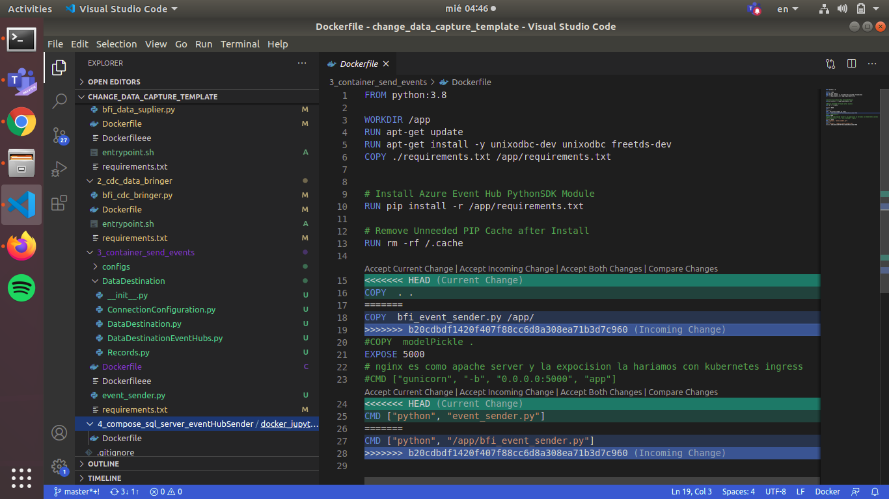

# git concepts that  look better in vscode

## git diff

I mean sure, you can see the plus a minus symbol but we both know that a graphical interface make out life easier

## merge conflict resolution

Something that may happen to you when you are colaborating with partners in a repository is the fact that both of you make changes in the same line so git does not know how to combine the versions of the file, that why it ask which of the two changes should make it to the final version. That is why we see one change in green the other one in blue, for the first button "accept current change" would ignore the changes than you friend made, "accept incomming change" would ignore your changes and the other would left both of them

