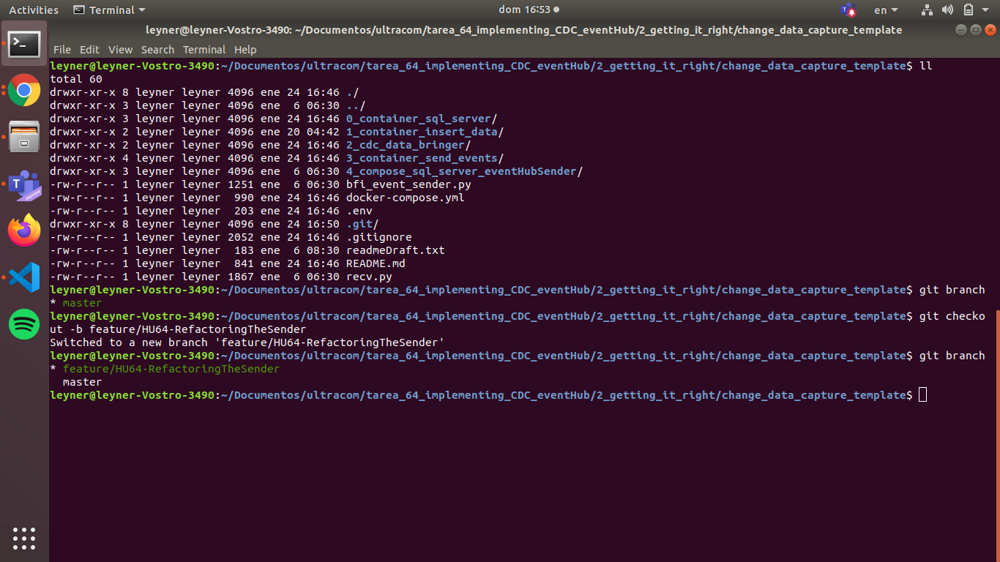

# git concepts that  look better in vscode

## git diff

I mean sure, you can see the plus a minus symbol but we both know that a graphical interface make out life easier

## merge conflict resolution

Something that may happen to you when you are colaborating with partners in a repository is the fact that both of you make changes in the same line so git does not know how to combine the versions of the file, that why it ask which of the two changes should make it to the final version. That is why we see one change in green the other one in blue, for the first button "accept current change" would ignore the changes than you friend made, "accept incomming change" would ignore your changes and the other would left both of them

## creating a branch for the task you are carrying out

Every time you must change or add something to a codebase you must create a branch where your changes are stored, when you are done developing you must create a merge request because what you created must be reviwed by your peers

## when you are creating your commits, add only the files that must go to the codebase 

Something that a lot of us usuarlly get used to doing is using the command git add -A or git add . or git add -am... the first two are used to add all the changes, the last one would also add all changes but also would commit it. In the image I only added the changes to the ReadMe.md file (in this case because even when I was going to add the image to the codebase I also want the commits to be as atommic as possible).

In this example I am adding the changes to just one file but you can use the git add to add changes to several files at the same time, something like, git add File_1.txt File_2.txt File_3.txt  

## In order to keep the codebase as clean (and lean) as possible use the gitignore file

The gitignore file is something we add to the codebase in order to avoid thing like the cache files (.pyc), the libraries installed in the lib folder and other files and folders not supposed to be in the codebase. This is not just a aesthetic issue, is also about productivity, when you need to clone the repository or deploy the code somewhere (like a server or a container) doing it fast increase the amount of things that you can do in a day.

